# Competition Service Architecture

Comprehensive documentation of the Competitions module following the 3-table schema redesign.

## Table of Contents

1. [Architecture Overview](#1-architecture-overview)
2. [Database Schema](#2-database-schema)
3. [Service Layer Architecture](#3-service-layer-architecture)
4. [Functional Workflows](#4-functional-workflows)
5. [Business Rules](#5-business-rules)
6. [Integration Points](#6-integration-points)
7. [API to Service Mapping](#7-api-to-service-mapping)

---

## 1. Architecture Overview

### 1.1 System Context

The Competitions module manages robotics competitions, team registrations, fee payments, and result tracking. It integrates with CRM (students, parents), Finance (payments, receipts), and Notifications modules.

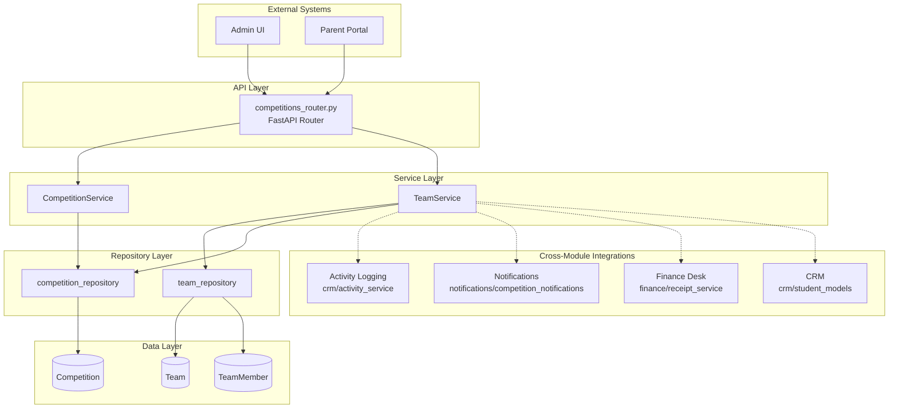

### 1.2 Module Structure

```
app/modules/competitions/
├── __init__.py                    # Service exports
├── models/
│   ├── competition_models.py      # Competition SQLModel
│   └── team_models.py             # Team, TeamMember SQLModels
├── repositories/
│   ├── competition_repository.py  # Competition CRUD
│   └── team_repository.py         # Team & TeamMember CRUD
├── services/
│   ├── competition_service.py     # Competition business logic
│   └── team_service.py            # Team & member business logic
├── schemas/
│   ├── competition_schemas.py     # Competition DTOs
│   └── team_schemas.py            # Team & member DTOs
└── routers/  (in app/api/routers/competitions_router.py)
```

---

## 2. Database Schema

### 2.1 3-Table Schema Design

The redesigned schema eliminates the `competition_categories` junction table, storing category/subcategory directly on the `teams` table using PostgreSQL `citext` for case-insensitive text.

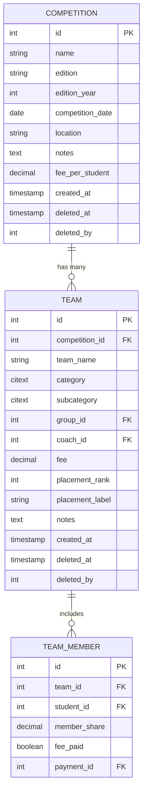

### 2.2 Schema Evolution

| Old Schema (4-table) | New Schema (3-table) | Benefit |
|---------------------|---------------------|---------|
| `competitions` → `categories` → `teams` | `competitions` → `teams` | Simpler hierarchy |
| `category_id` FK on teams | `category` citext on teams | Direct category naming |
| Separate categories table | Inline in teams | No category management needed |
| Case-sensitive names | PostgreSQL `citext` | Case-insensitive auto-handling |

---

## 3. Service Layer Architecture

### 3.1 CompetitionService

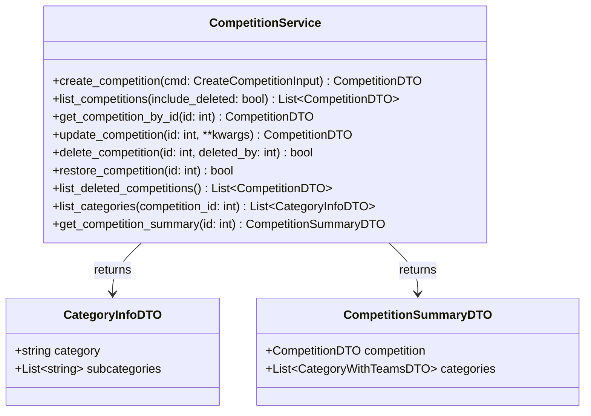

### 3.2 TeamService

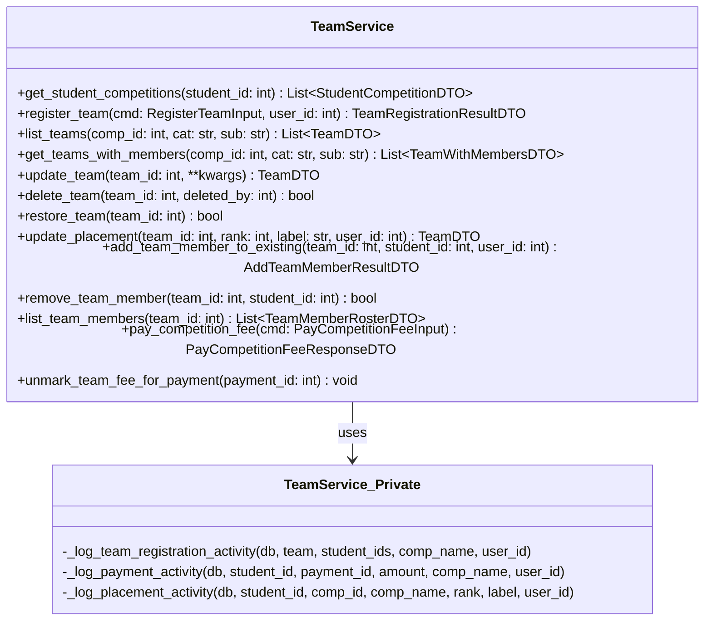

---

## 4. Functional Workflows

### 4.1 Team Registration Workflow

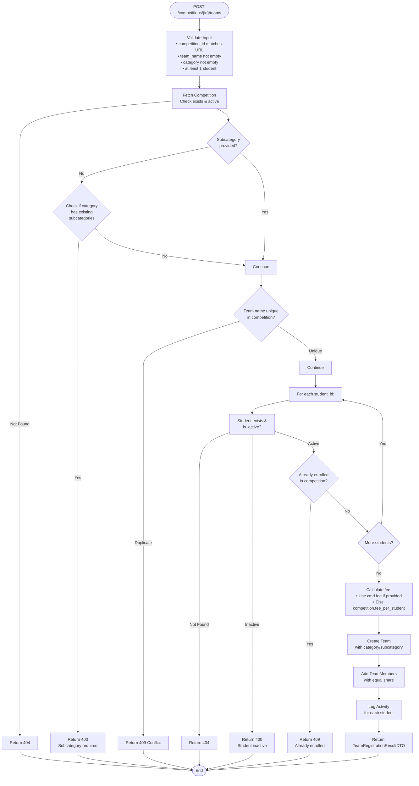

### 4.2 Payment Processing Workflow (with Atomic Rollback)

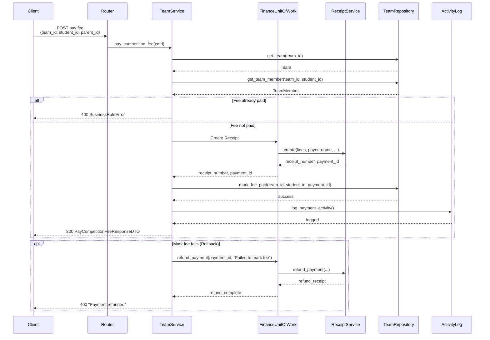

### 4.3 Placement Update Workflow

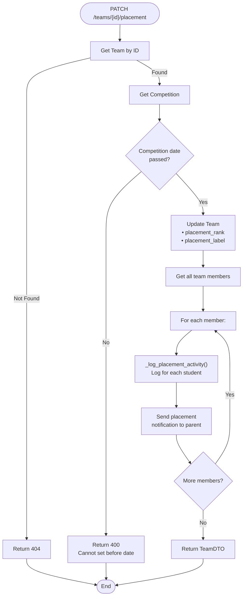

### 4.4 Soft Delete Workflow (Team)

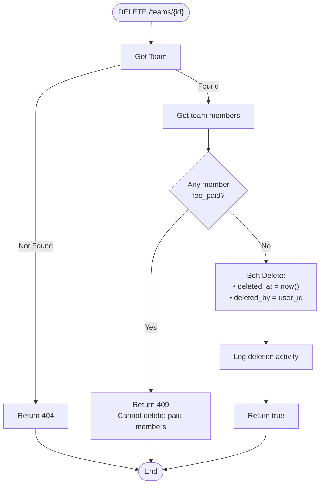

### 4.5 Category Listing (3-Table Schema)

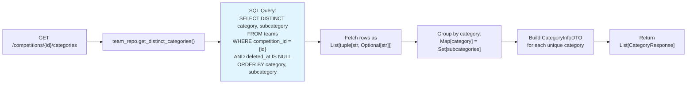

---

## 5. Business Rules

### 5.1 Rule Enforcement Matrix

| Rule | Validation Point | Error Type | Service Method |
|------|-----------------|------------|----------------|
| **One student per competition** | `team_repo.check_student_in_competition()` | ConflictError | `register_team()`, `add_team_member_to_existing()` |
| **Subcategory required** | `team_repo.check_category_has_subcategories()` | BusinessRuleError | `register_team()` |
| **Team name uniqueness** | Case-insensitive comparison against existing teams | ConflictError | `register_team()` |
| **Student must be active** | `student.is_active` check | NotFoundError | `register_team()` |
| **Paid member protection** | `member.fee_paid` check before removal | BusinessRuleError | `remove_team_member()`, `delete_team()` |
| **Placement timing** | `competition.competition_date > today()` check | BusinessRuleError | `update_placement()` |
| **Competition has no teams** | `team_repo.list_teams()` empty check | BusinessRuleError | `delete_competition()` |

### 5.2 One Student Per Competition Validation

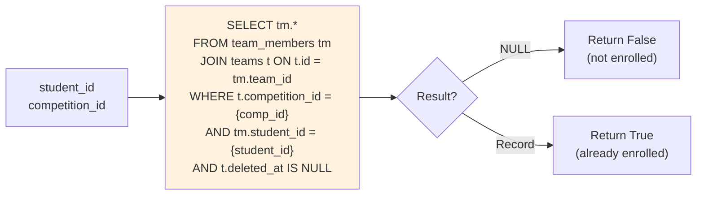

### 5.3 Member Share Calculation

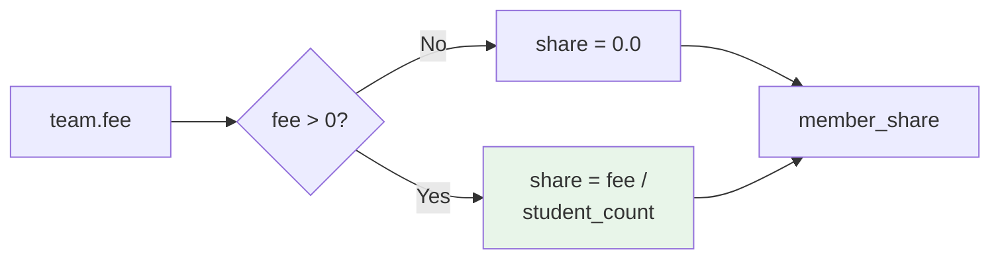

---

## 6. Integration Points

### 6.1 Activity Logging Integration

Activity logging is performed asynchronously to not block the main transaction.

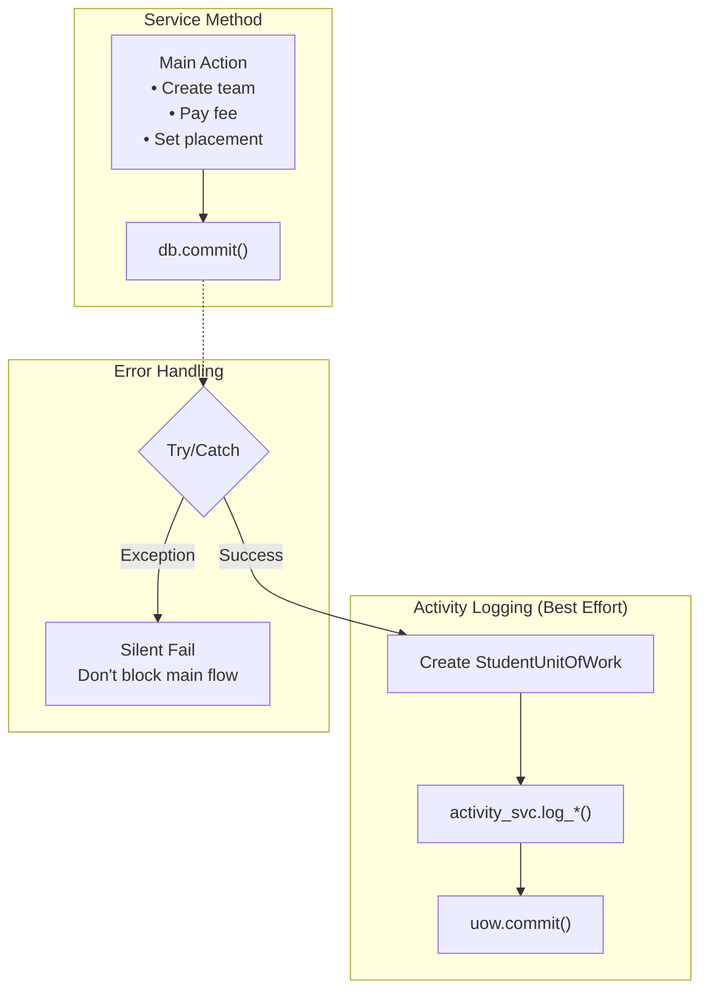

### 6.2 Finance Module Integration

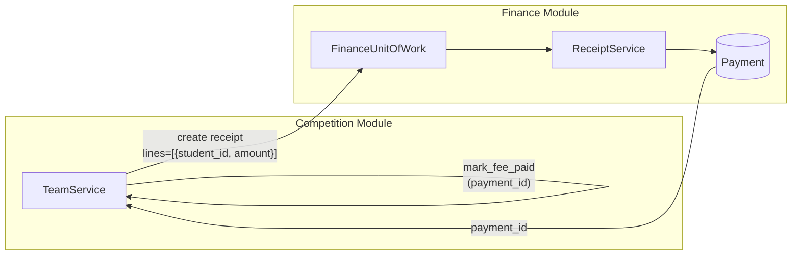

### 6.3 Notification Integration

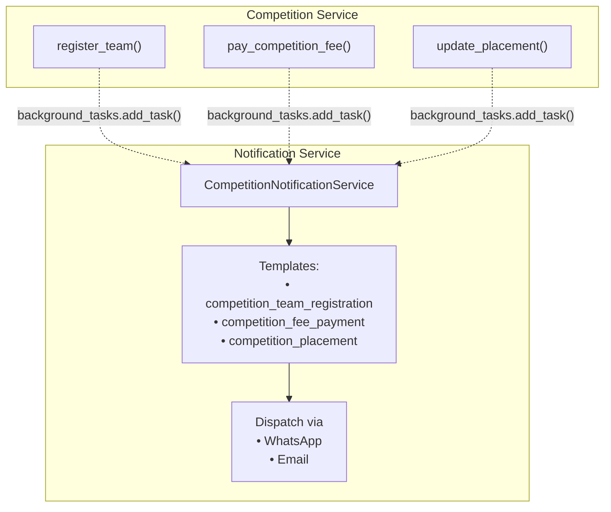

---

## 7. API to Service Mapping

### 7.1 Endpoint Reference

| Endpoint | Method | Service Method | Business Rules Applied |
|----------|--------|---------------|----------------------|
| `GET /competitions` | CompetitionService.list_competitions() | - |
| `POST /competitions` | CompetitionService.create_competition() | - |
| `GET /competitions/{id}` | CompetitionService.get_competition_by_id() | - |
| `GET /competitions/{id}/categories` | CompetitionService.list_categories() | - |
| `GET /competitions/{id}/teams` | TeamService.get_teams_with_members() | Filter by cat/subcat |
| `POST /competitions/{id}/teams` | TeamService.register_team() | One student/comp, subcategory required, name unique |
| `DELETE /competitions/{id}` | CompetitionService.delete_competition() | No teams allowed |
| `POST /competitions/{id}/restore` | CompetitionService.restore_competition() | - |
| `GET /competitions/deleted` | CompetitionService.list_deleted_competitions() | Admin only |
| `GET /teams/{id}` | - | - |
| `PATCH /teams/{id}/placement` | TeamService.update_placement() | Competition date passed |
| `DELETE /teams/{id}` | TeamService.delete_team() | No paid members |
| `POST /teams/{id}/restore` | TeamService.restore_team() | - |
| `POST /competitions/{cid}/teams/{tid}/members/{sid}/pay` | TeamService.pay_competition_fee() | Atomic rollback |

### 7.2 DTO Flow

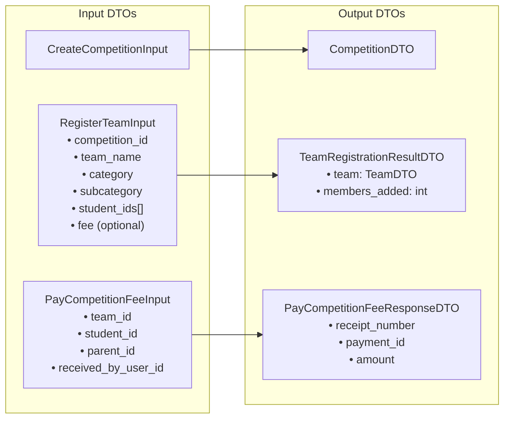

---

## Appendix: Database Migration Summary

Migration: `035_competitions_3table_redesign.sql`

| Table | Changes |
|-------|---------|
| **competitions** | Add `edition_year` (int), `deleted_at` (timestamp), `deleted_by` (int) |
| **teams** | Add `competition_id` (FK), `category` (citext), `subcategory` (citext), `fee` (decimal), `placement_rank` (int), `placement_label` (varchar), `notes` (text), `deleted_at`, `deleted_by` |
| **New Indexes** | `idx_teams_competition_category_subcategory` for filtering |
| **Trigger** | `trim_team_category()` - auto-trims whitespace on insert/update |

---

*Document generated for the Competitions Module 3-Table Schema Redesign*
