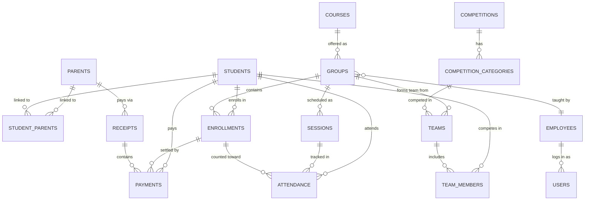

# Techno Terminal — PostgreSQL Database Schema (v3.4)

**Engine:** PostgreSQL 15+ | **Tables:** 16 | **Views:** 20+ | **Migrations:** 44 | **Indexes:** 30+

---

## Entity Relationship Diagram



---

## Tables (21)

| # | Table | Key Columns | Notable |
|---|---|---|---|
| 1 | `parents` | full_name, phone_primary, phone_secondary | Contact owner. |
| 2 | `students` | full_name, date_of_birth, gender, phone | Soft-delete via `deleted_at`. No `age` (derived). |
| 3 | `student_parents` | student_id, parent_id, is_primary | Junction table (supports split families/divorced parents). |
| 4 | `employees` | full_name, job_title, employment_type | No auth role. `contract_percentage` for payroll. |
| 5 | `users` | username, supabase_uid, role | Supabase Auth linked. Roles: `admin`, `system_admin`. |
| 6 | `courses` | name, category, price_per_level, sessions_per_level | CHECK on price > 0, sessions > 0. |
| 7 | `groups` | name, course_id, instructor_id, level_number | No `session_count` (derived). CHECK on time range. |
| 8 | `sessions` | group_id, **level_number**, session_number, session_date | Level snapshot fixes "time travel" problem. |
| 9 | `enrollments` | student_id, group_id, **level_number**, amount_due | Level snapshot. Partial unique on active. |
| 10 | `attendance` | student_id, session_id, **enrollment_id**, status | Enrollment ID is NOT NULL (no orphans). |
| 11 | `receipts` | parent_id, method, receipt_number | Groups split payments. No stored `total_amount` (derived). |
| 12 | `payments` | receipt_id, student_id, enrollment_id, amount | Line items. Soft-delete via `deleted_at`. |
| 13 | `competitions` | name, edition, date | Annual events. |
| 14 | `competition_categories` | competition_id, category_name | FLL→Explore/Challenge/Discover. |
| 15 | `teams` | category_id, group_id, team_name, coach_id | group_id nullable for multi-group teams. |
| 16 | `team_members` | team_id, student_id, fee_paid, payment_id | Per-student fee tracking. |
| 17 | `student_activity_log` | student_id, activity_type, description, metadata | Unified activity timeline (replaces history tables). |
| 18 | `notification_templates` | template_key, name, body_template, channel | Reusable message templates. |
| 19 | `notification_logs` | template_id, recipient_type, recipient_id, status | History of sent notifications. |
| 20 | `notification_additional_recipients` | admin_id, email, notification_types | Additional non-admin notification recipients. |
| 21 | `admin_notification_settings` | admin_id, notification_type, is_enabled | Admin notification preferences. |

## Views (20+)

| View | Purpose |
|---|---|
| `v_students` | Age (derived), parent name, parent phone, student phone |
| `v_enrollment_balance` | net_due, total_paid, balance per enrollment |
| `v_enrollment_attendance` | sessions_attended, sessions_missed per enrollment |
| `v_siblings` | Active sibling pairs sharing a parent |
| `v_group_session_count` | Regular/extra/total session count per group per level |
| `active_students` | Non-deleted students (soft-delete filter) |
| `deleted_students` | Soft-deleted students only (recovery/admin) |
| `active_payments` | Non-deleted payments |
| `deleted_payments` | Soft-deleted payments only |
| `active_competitions` | Non-deleted competitions |
| `active_teams` | Non-deleted teams |
| `v_unpaid_enrollments` | Enrollments with outstanding balance |
| `v_student_payment_history` | Complete payment history per student |
| `v_student_financial_summary` | Aggregated financial data per student |
| `v_student_activity_timeline` | Recent activity across all domains |
| `v_daily_collections` | Receipts grouped by date for reporting |
| `v_payment_allocations_detailed` | Payment-to-enrollment allocation details |
| `v_group_enrollment_status` | Group capacity and enrollment counts |
| `v_instructor_schedule` | Upcoming sessions by instructor |
| `v_parent_contact_summary` | Parent info with student count |

---

## Key Changes

### v3.0 → v3.1

| Problem | Fix |
|---|---|
| Sessions couldn't distinguish Level 1 vs Level 2 | Added `sessions.level_number` — immutable snapshot |
| Split payments impossible | Added `receipts` table — one receipt, many payments |
| Students couldn't have phones | Added `students.phone` (optional, for teens) |
| Parents had phone + whatsapp (usually same) | Replaced with `phone_primary` + `phone_secondary` |
| No CHECK on time ranges | `CHECK (start_time < end_time)` on groups and sessions |
| No CHECK on amounts | `CHECK (amount > 0)`, `CHECK (price > 0)`, `CHECK (discount >= 0)` |
| No CHECK on capacity | `CHECK (max_capacity > 0)` — NULL = unlimited |
| No session count per level | `v_group_session_count` view with level breakdown |
| Timestamps | `updated_at` never auto-updated | Handled entirely by the backend application logic |

### v3.1 → v3.4 (Recent)

| Migration | Change |
|---|---|
| 033 | Added `deleted_at` soft-delete columns to students, payments |
| 034-037 | Notification system tables (templates, logs, settings) |
| 038 | Student activity log (unified history) |
| 040 | Competition 3-table redesign (teams, members, categories) |
| 041-044 | Schema cleanup, DTO alignment, history consolidation |
| 045 | **Removed `students.is_active`** — use `status` enum only |

---

## Financial Model (v3.3)

```
RECEIPT (physical transaction):
  Parent pays 1500 EGP cash → 1 receipt row (no total stored)
  ├── Payment 1: 650 EGP (charge/payment) → Enrollment #10  [course_level]
  ├── Payment 2: 550 EGP (charge/payment) → Enrollment #15  [course_level]
  └── Payment 3: 300 EGP (charge/payment) → Team Member    [competition]

REFUNDS:
  Parent cancels → Insert payment row with `amount > 0` and `transaction_type = 'refund'`.

BALANCE (per enrollment):
  enrollment.amount_due - enrollment.discount_applied = net_due
  SUM(payments if 'payment'/'charge') - SUM(payments if 'refund') = total_paid
  net_due - total_paid = outstanding balance
```

---

## CHECK Constraints Summary

| Table | Constraint |
|---|---|
| `employees` | `employment_type IN ('full_time', 'part_time', 'contract')` |
| `users` | `role IN ('admin', 'system_admin')` |
| `students` | `gender IN ('male', 'female')` |
| `courses` | `category IN (...)`, `price > 0`, `sessions > 0` |
| `groups` | `status IN (...)`, `level > 0`, `capacity > 0`, `start < end` |
| `sessions` | `start < end` |
| `enrollments` | `status IN (...)`, `amount >= 0`, `discount >= 0` |
| `attendance` | `status IN ('present', 'absent', 'cancelled')` |
| `payments` | `type IN (...)`, `method IN (...)`, `transaction_type IN ('charge', 'payment', 'refund')`, `amount != 0`, `discount >= 0` |
| `teams` | `fee > 0` |

---

## Design Principles

1.  **No cached counters** — all counts derived from source tables via views.
2.  **Level snapshots** — `sessions.level_number` and `enrollments.level_number` freeze history.
3.  **Data Permanence** — Critical entities (`groups`, `receipts`, etc.) use `ON DELETE RESTRICT` to prevent accidental CASCADE wipes of historical data.
4.  **No stored totals** — `receipts.total_amount` is removed; math is evaluated dynamically to prevent drift.
5.  **Multi-Parent Architecture** — `student_parents` junction table allows split families (divorced parents) to both receive links.
6.  **Full Refund Support** — Refunds are positive amounts typed as `'refund'`, keeping the ledger append-only without breaking `CHECK` constraints.
7.  **No Orphans** — `attendance` MUST link to an `enrollment_id`.
8.  **Soft-Delete Pattern** — Students and payments use `deleted_at` timestamp for recovery instead of hard DELETE.
9.  **Unified Activity Log** — `student_activity_log` replaces separate history tables for cleaner audit trail.
10. **Backend Data Types** — `created_at` and `updated_at` are handled entirely by backend application logic.
