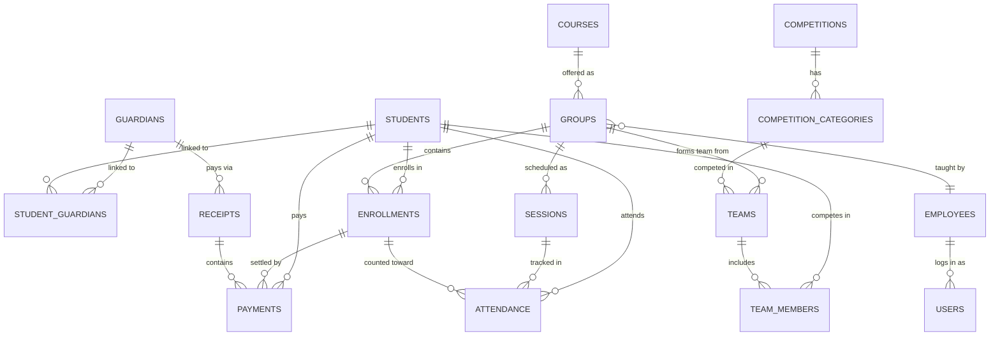

# Techno Kids — PostgreSQL Database Schema (v3.1)

**Engine:** PostgreSQL 15+ | **Tables:** 15 | **Views:** 5 | **Indexes:** 23

---

## Entity Relationship Diagram



---

## Tables (16)

| # | Table | Key Columns | Notable |
|---|---|---|---|
| 1 | `guardians` | name, phone_primary, phone_secondary | Contact owner. |
| 2 | `students` | name, dob, gender, phone | Phone optional (teens). No `age` (derived). |
| 3 | `student_guardians` | student_id, guardian_id, is_primary | Junction table (supports split families/divorced parents). |
| 4 | `employees` | name, job_title, employment_type | No auth role. `contract_percentage` for payroll. |
| 5 | `users` | username, password_hash, role | Role lives HERE only (`admin`, `system_admin`). |
| 6 | `courses` | name, category, price, sessions_per_level | CHECK on price > 0, sessions > 0. |
| 7 | `groups` | name, course_id, instructor_id, level_number | No `session_count` (derived). CHECK on time range. |
| 8 | `sessions` | group_id, **level_number**, session_number, date | Level snapshot fixes "time travel" problem. |
| 9 | `enrollments` | student_id, group_id, **level_number**, amount_due | Level snapshot. Partial unique on active. |
| 10 | `attendance` | student_id, session_id, **enrollment_id**, status | Enrollment ID is NOT NULL (no orphans). |
| 11 | `receipts` | guardian_id, method, receipt_number | Groups split payments. No stored `total_amount` (derived). |
| 12 | `payments` | receipt_id, student_id, enrollment_id, amount | Line items. Supports refunds (`transaction_type`). |
| 13 | `competitions` | name, edition, date | Annual events. |
| 14 | `competition_categories` | competition_id, category_name | FLL→Explore/Challenge/Discover. |
| 15 | `teams` | category_id, group_id, team_name, coach_id | group_id nullable for multi-group teams. |
| 16 | `team_members` | team_id, student_id, fee_paid, payment_id | Per-student fee tracking. |

## Views (5)

| View | Purpose |
|---|---|
| `v_students` | Age (derived), guardian name, guardian phone, student phone |
| `v_enrollment_balance` | net_due, total_paid, balance per enrollment |
| `v_enrollment_attendance` | sessions_attended, sessions_missed per enrollment |
| `v_siblings` | Active sibling pairs sharing a guardian |
| `v_group_session_count` | Regular/extra/total session count per group per level |

---

## Key Changes (v3.0 → v3.1)

| Problem | Fix |
|---|---|
| Sessions couldn't distinguish Level 1 vs Level 2 | Added `sessions.level_number` — immutable snapshot |
| Split payments impossible | Added `receipts` table — one receipt, many payments |
| Students couldn't have phones | Added `students.phone` (optional, for teens) |
| Guardians had phone + whatsapp (usually same) | Replaced with `phone_primary` + `phone_secondary` |
| No CHECK on time ranges | `CHECK (start_time < end_time)` on groups and sessions |
| No CHECK on amounts | `CHECK (amount > 0)`, `CHECK (price > 0)`, `CHECK (discount >= 0)` |
| No CHECK on capacity | `CHECK (max_capacity > 0)` — NULL = unlimited |
| No session count per level | `v_group_session_count` view with level breakdown |
| Timestamps | `updated_at` never auto-updated | Handled entirely by the backend application logic |

---

## Financial Model (v3.3)

```
RECEIPT (physical transaction):
  Parent pays 1500 EGP cash → 1 receipt row (no total stored)
  ├── Payment 1: 650 EGP (charge/payment) → Enrollment #10  [course_level]
  ├── Payment 2: 550 EGP (charge/payment) → Enrollment #15  [course_level]
  └── Payment 3: 300 EGP (charge/payment) → Team Member    [competition]

REFUNDS:
  Parent cancels → Insert payment row with `amount > 0` and `transaction_type = 'refund'`.

BALANCE (per enrollment):
  enrollment.amount_due - enrollment.discount_applied = net_due
  SUM(payments if 'payment'/'charge') - SUM(payments if 'refund') = total_paid
  net_due - total_paid = outstanding balance
```

---

## CHECK Constraints Summary

| Table | Constraint |
|---|---|
| `employees` | `employment_type IN ('full_time', 'part_time', 'contract')` |
| `users` | `role IN ('admin', 'system_admin')` |
| `students` | `gender IN ('male', 'female')` |
| `courses` | `category IN (...)`, `price > 0`, `sessions > 0` |
| `groups` | `status IN (...)`, `level > 0`, `capacity > 0`, `start < end` |
| `sessions` | `start < end` |
| `enrollments` | `status IN (...)`, `amount >= 0`, `discount >= 0` |
| `attendance` | `status IN ('present', 'absent', 'late', 'excused')` |
| `payments` | `type IN (...)`, `method IN (...)`, `transaction_type IN ('charge', 'payment', 'refund')`, `amount != 0`, `discount >= 0` |
| `teams` | `fee > 0` |

---

## Design Principles

1.  **No cached counters** — all counts derived from source tables via views.
2.  **Level snapshots** — `sessions.level_number` and `enrollments.level_number` freeze history.
3.  **Data Permanence** — Critical entities (`groups`, `receipts`, etc.) use `ON DELETE RESTRICT` to prevent accidental CASCADE wipes of historical data.
4.  **No stored totals** — `receipts.total_amount` is removed; math is evaluated dynamically to prevent drift.
5.  **Multi-Guardian Architecture** — `student_guardians` junction table allows split families (divorced parents) to both receive links.
6.  **Full Refund Support** — Refunds are positive amounts typed as `'refund'`, keeping the ledger append-only without breaking `CHECK` constraints.
7.  **No Orphans** — `attendance` MUST link to an `enrollment_id`.
8.  **Backend Data Types** — `created_at` and `updated_at` are handled entirely by backend application logic.
