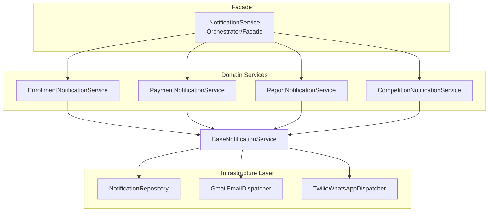
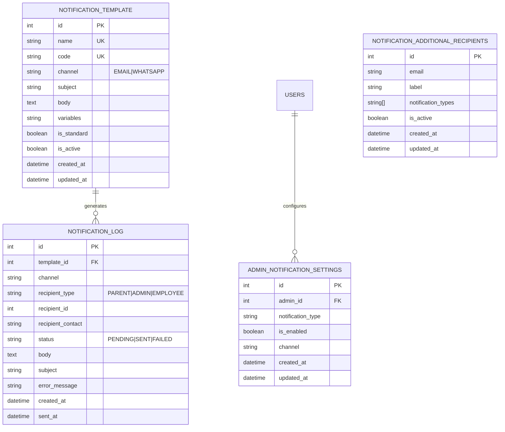
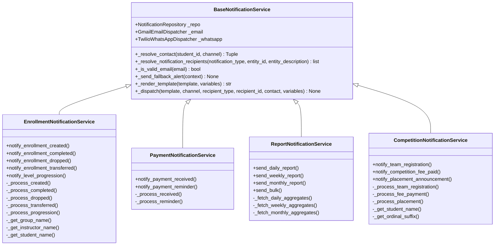
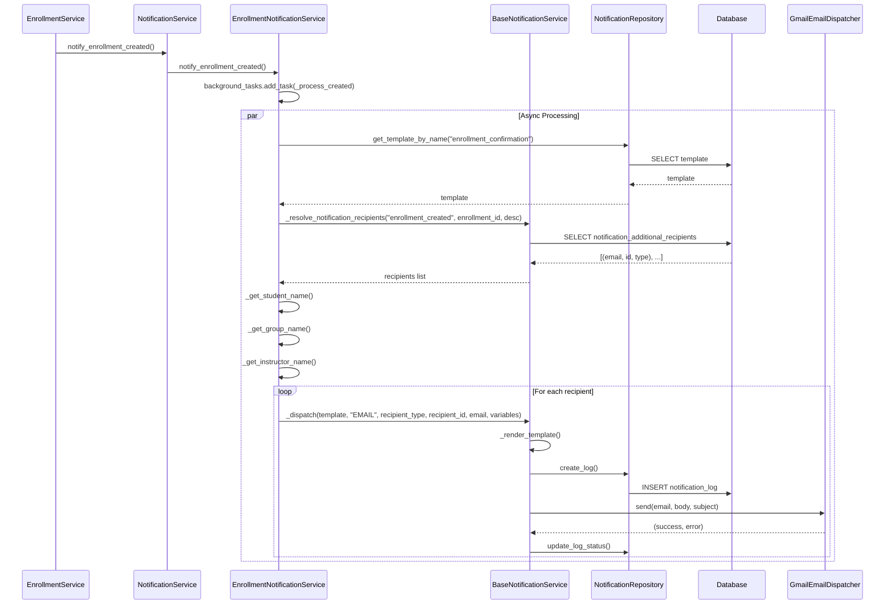
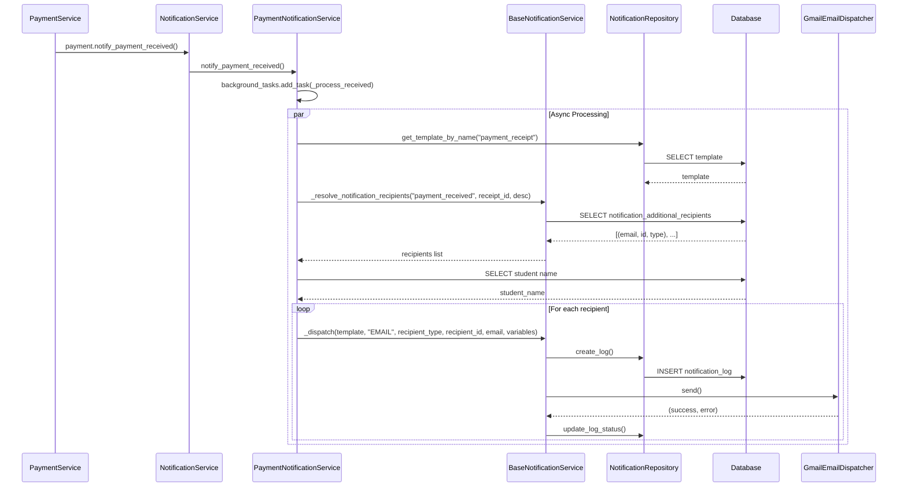
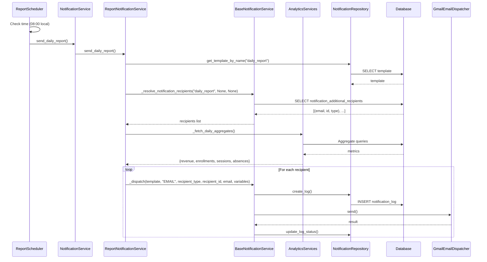
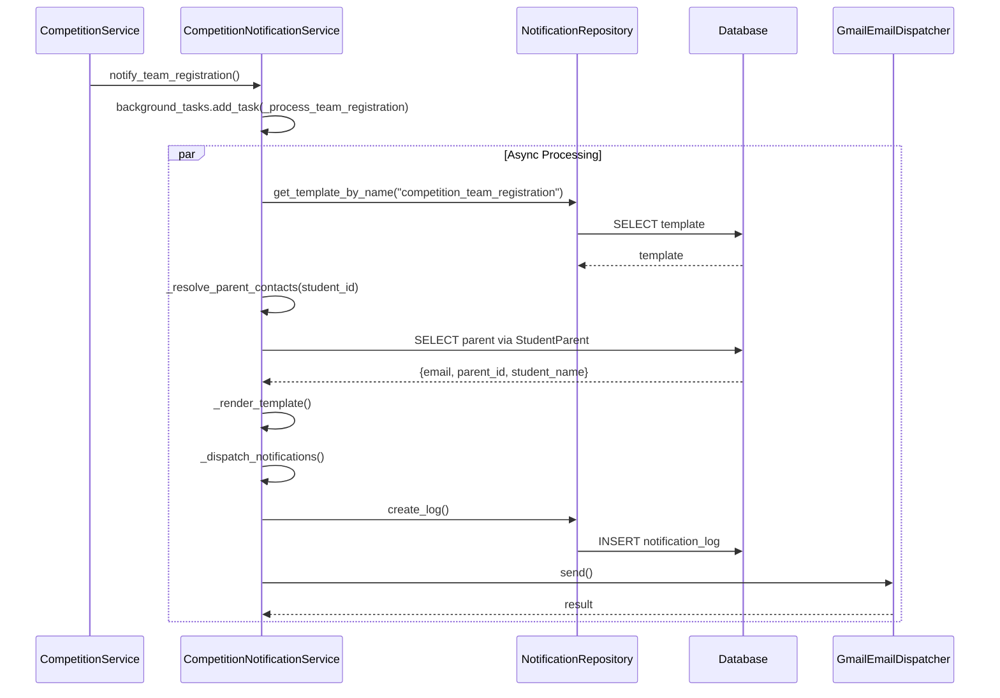
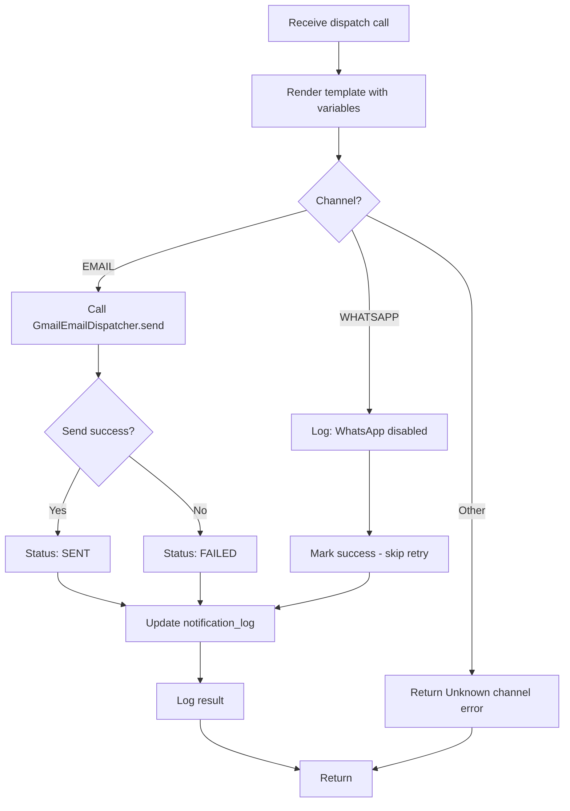

# Notification Service Architecture

Comprehensive documentation of the modular notification system for the CRM application.

## Table of Contents

1. [Architecture Overview](#1-architecture-overview)
2. [Data Model](#2-data-model)
3. [Service Hierarchy](#3-service-hierarchy)
4. [Notification Workflows](#4-notification-workflows)
5. [Design Decisions](#5-design-decisions)
6. [File Reference](#6-file-reference)

---

## 1. Architecture Overview

### Module Structure

```
app/modules/notifications/
├── __init__.py
├── interfaces/
│   └── i_notification_repository.py      # Protocol contracts
├── models/
│   ├── notification_template.py           # Template entity
│   └── notification_log.py                # Audit log entity
├── schemas/
│   ├── admin_settings_dto.py              # Admin settings DTOs
│   ├── template_dto.py                    # Template DTOs
│   └── fallback_dto.py                    # Fallback alert DTOs
├── repositories/
│   ├── notification_repository.py         # Data access layer
│   └── admin_settings_repository.py       # Admin settings data access
├── dispatchers/
│   ├── i_dispatcher.py                    # Abstract dispatcher interface
│   ├── email_dispatcher.py                # Gmail SMTP implementation
│   └── whatsapp_dispatcher.py             # Twilio WhatsApp implementation
└── services/
    ├── __init__.py                        # Exports all services
    ├── base_notification_service.py       # Shared helpers (contact resolution, dispatch)
    ├── notification_service.py            # Main orchestrator (facade)
    ├── enrollment_notifications.py      # Enrollment lifecycle
    ├── payment_notifications.py          # Payment events
    ├── report_notifications.py            # Scheduled reports
    └── competition_notifications.py     # Competition events
```

### Service Hierarchy Diagram



---

## 2. Data Model

### Entity Relationship Diagram



### Template Variables

| Template | Variables |
|----------|-----------|
| `enrollment_confirmation` | `parent_name`, `student_name`, `group_name`, `level_number`, `instructor_name`, `enrollment_id` |
| `enrollment_completed` | `parent_name`, `student_name`, `group_name`, `level_number`, `completion_date`, `enrollment_id` |
| `enrollment_dropped` | `parent_name`, `student_name`, `group_name`, `reason`, `enrollment_id` |
| `enrollment_transferred` | `parent_name`, `student_name`, `from_group_name`, `to_group_name`, `from_enrollment_id`, `to_enrollment_id` |
| `level_progression` | `parent_name`, `student_name`, `old_level`, `new_level`, `group_name`, `enrollment_id` |
| `payment_receipt` | `parent_name`, `student_name`, `amount`, `receipt_number`, `receipt_id` |
| `payment_reminder` | `parent_name`, `student_name`, `amount_due`, `due_date` |
| `daily_report` | `date`, `total_revenue`, `new_enrollments`, `sessions_held`, `absent_count` |
| `weekly_report` | `week_start`, `week_end`, `total_revenue`, `new_students`, `attendance_rate` |
| `monthly_report` | `month`, `total_revenue`, `new_enrollments`, `active_students` |
| `competition_team_registration` | `student_name`, `team_name`, `competition_name`, `category` |
| `competition_fee_payment` | `student_name`, `team_name`, `competition_name`, `amount`, `receipt_number` |
| `competition_placement` | `student_name`, `team_name`, `competition_name`, `placement_rank`, `placement_label`, `rank_display` |

---

## 3. Service Hierarchy

### BaseNotificationService

Core infrastructure class providing:



---

## 4. Notification Workflows

### 4.1 Enrollment Notification Flow



### 4.2 Payment Notification Flow



### 4.3 Report Notification Flow



### 4.4 Competition Notification Flow



### 4.5 Dispatch Flow (Core Mechanism)



---

## 5. Design Decisions

### 5.1 Modular Service Architecture

**Decision:** Split monolithic `NotificationService` into domain-specific services.

**Rationale:**
- Single Responsibility: Each service handles one notification domain
- Maintainability: Changes to enrollment notifications don't affect payment logic
- Testability: Smaller classes are easier to unit test
- Extensibility: New domains (like competitions) can be added without touching existing code

### 5.2 FastAPI BackgroundTasks

**Decision:** Use `BackgroundTasks` for async notification processing.

**Rationale:**
- No external message queue needed (Redis/RabbitMQ)
- Simple deployment and operations
- Sufficient for current volume (<1000 notifications/day)
- Can be upgraded to Celery/RQ later without API changes

### 5.3 Admin-First Notification Strategy

**Decision:** Send all notifications to admin emails, disable parent notifications.

**Rationale:**
- Business requirement: Admins need visibility into all system events
- WhatsApp integration not yet ready
- Parent code preserved as commented blocks for easy re-enabling
- Future: Admin preference panel to control which notifications each admin receives

### 5.4 Template Variable System

**Decision:** Simple `{{variable}}` substitution, no complex templating engine.

**Rationale:**
- Easy to understand and debug
- No external dependencies (Jinja2, etc.)
- Sufficient for current needs
- Variables stored as JSON array in database

### 5.5 Contact Resolution Strategy

**Decision:** Single resolution path using `notification_additional_recipients` table globally.

**Key Points:**
- Recipients are configured globally in `notification_additional_recipients` table
- No per-admin filtering - all active recipients receive notifications
- `_resolve_notification_recipients(notification_type, entity_id, entity_description)` handles resolution
- Entity context (ID and description) passed for fallback alert context

**Rationale:**
- Simplified configuration - one global recipient list
- No dependency on `users` table for email delivery
- Easy to manage via admin settings API

### 5.6 Centralized Fallback Mechanism

**Decision:** Automatic fallback to environment-configured email when no valid recipients exist.

**Implementation:**
- `_resolve_notification_recipients()` automatically detects empty recipient list
- Fallback email configured via `NOTIFICATION_FALLBACK_EMAIL` environment variable (default: `ibrahim.ahmd.net@gmail.com`)
- `FallbackAlertContext` DTO provides notification type, entity ID, and description
- `_send_fallback_alert()` sends alert to fallback email with full context
- Fallback activations logged to `notification_log` table with `FALLBACK_ALERT` recipient type

**Rationale:**
- Ensures no notifications are silently lost
- Immediate alerting when configuration issues occur
- Full context in alerts for rapid debugging
- No duplicate code across notification services

### Core Files

| File | Purpose | Key Classes/Functions |
|------|---------|---------------------|
| `app/modules/notifications/services/notification_service.py` | Main orchestrator | `NotificationService` - facade over domain services |
| `app/modules/notifications/services/base_notification_service.py` | Shared infrastructure | `BaseNotificationService` - contact resolution, dispatch |
| `app/modules/notifications/services/enrollment_notifications.py` | Enrollment lifecycle | `EnrollmentNotificationService` - 5 notification types |
| `app/modules/notifications/services/payment_notifications.py` | Payment events | `PaymentNotificationService` - 2 notification types |
| `app/modules/notifications/services/report_notifications.py` | Scheduled reports | `ReportNotificationService` - 3 report types + bulk |
| `app/modules/notifications/services/competition_notifications.py` | Competition events | `CompetitionNotificationService` - 3 notification types |

### API Routers

| File | Purpose | Base Path |
|------|---------|-----------|
| `app/api/routers/notifications/admin_settings_router.py` | Admin settings & additional recipients | `/api/v1/notifications/admin` |
| `app/api/routers/notifications/templates_router.py` | Template CRUD operations | `/api/v1/notifications/templates` |
| `app/api/routers/notifications/bulk_router.py` | Bulk messaging | `/api/v1/notifications/bulk` |
| `app/api/routers/notifications/notifications_router.py` | Notification logs & history | `/api/v1/notifications/logs` |

### API Documentation

Comprehensive API documentation is available under `docs/api/notifications/`:

| File | Description |
|------|-------------|
| `docs/api/notifications/index.md` | Overview and getting started guide |
| `docs/api/notifications/admin_settings.md` | Admin notification settings API |
| `docs/api/notifications/templates.md` | Template CRUD and test endpoint |
| `docs/api/notifications/testing.md` | Template testing endpoint documentation |
| `docs/api/notifications/bulk.md` | Bulk messaging API |
| `docs/api/notifications/logs.md` | Notification logs API |

### Infrastructure Files

| File | Purpose |
|------|---------|
| `app/modules/notifications/repositories/notification_repository.py` | Data access for templates and logs |
| `app/modules/notifications/dispatchers/email_dispatcher.py` | Gmail SMTP implementation |
| `app/modules/notifications/dispatchers/whatsapp_dispatcher.py` | Twilio WhatsApp (currently disabled) |
| `app/modules/notifications/dispatchers/i_dispatcher.py` | Protocol interface for dispatchers |
| `app/modules/notifications/interfaces/i_notification_repository.py` | Protocol for repository |

### Models

| File | Entity |
|------|--------|
| `app/modules/notifications/models/notification_template.py` | `NotificationTemplate` |
| `app/modules/notifications/models/notification_log.py` | `NotificationLog` |

### Database Migrations

| File | Purpose |
|------|---------|
| `db/migrations/020_notification_templates.sql` | Initial templates (enrollment, payment, reports) |
| `db/migrations/034_notification_templates.sql` | Extended templates |
| `db/migrations/038_admin_notification_settings.sql` | Admin notification preferences table |
| `db/migrations/039_notification_additional_recipients.sql` | Additional email recipients table |
| `db/migrations/040_competition_templates.sql` | Competition notification templates |

### Scheduler

| File | Purpose |
|------|---------|
| `app/modules/notifications/services/report_scheduler.py` | Asyncio task for scheduled reports |

---

## Appendix: Method Signatures

### EnrollmentNotificationService

```python
def notify_enrollment_created(
    self, student_id: int, enrollment_id: int, group_id: int,
    level_number: int, background_tasks: BackgroundTasks
) -> None

def notify_enrollment_completed(
    self, student_id: int, enrollment_id: int, group_id: int,
    level_number: int, completion_date: datetime, background_tasks: BackgroundTasks
) -> None

def notify_enrollment_dropped(
    self, student_id: int, enrollment_id: int, group_id: int,
    reason: Optional[str], dropped_by: Optional[int], background_tasks: BackgroundTasks
) -> None

def notify_enrollment_transferred(
    self, student_id: int, from_enrollment_id: int, to_enrollment_id: int,
    from_group_id: int, to_group_id: int, transferred_by: Optional[int],
    background_tasks: BackgroundTasks
) -> None

def notify_level_progression(
    self, student_id: int, old_level: int, new_level: int,
    group_id: int, enrollment_id: int, background_tasks: BackgroundTasks
) -> None
```

### PaymentNotificationService

```python
def notify_payment_received(
    self, receipt_id: int, student_id: int, amount: str,
    receipt_number: str, background_tasks: BackgroundTasks
) -> None

def notify_payment_reminder(
    self, student_id: int, amount_due: str, due_date: str,
    background_tasks: BackgroundTasks
) -> None
```

### ReportNotificationService

```python
async def send_daily_report(self) -> None
async def send_weekly_report(self) -> None
async def send_monthly_report(self) -> None
def send_bulk(
    self, parent_ids: list[int], template_name: str, 
    extra_vars: dict, background_tasks
) -> int
```

### CompetitionNotificationService

```python
def notify_team_registration(
    self, student_id: int, team_id: int, team_name: str,
    competition_name: str, category: str, subcategory: Optional[str],
    background_tasks: BackgroundTasks
) -> None

def notify_competition_fee_paid(
    self, student_id: int, team_id: int, team_name: str,
    competition_name: str, amount: Decimal, receipt_number: str,
    background_tasks: BackgroundTasks
) -> None

def notify_placement_announcement(
    self, student_id: int, team_id: int, team_name: str,
    competition_name: str, placement_rank: int,
    placement_label: Optional[str], background_tasks: BackgroundTasks
) -> None
```

### BaseNotificationService

```python
def _resolve_notification_recipients(
    self,
    notification_type: str,
    entity_id: Optional[int] = None,
    entity_description: Optional[str] = None
) -> list[tuple[str, int, str]]
"""Returns list of (email, recipient_id, recipient_type) tuples.
Recipient types: 'ADDITIONAL' for table recipients, 'FALLBACK' for fallback email.
Fallback is automatically triggered when no valid recipients exist."""

@staticmethod
def _is_valid_email(email: str) -> bool
"""Validate email format using regex pattern."""

async def _send_fallback_alert(self, context: FallbackAlertContext) -> None
"""Send alert notification to fallback email about fallback activation.
Triggered automatically by _resolve_notification_recipients when fallback occurs."""
```

---

*Last Updated: April 2026*
