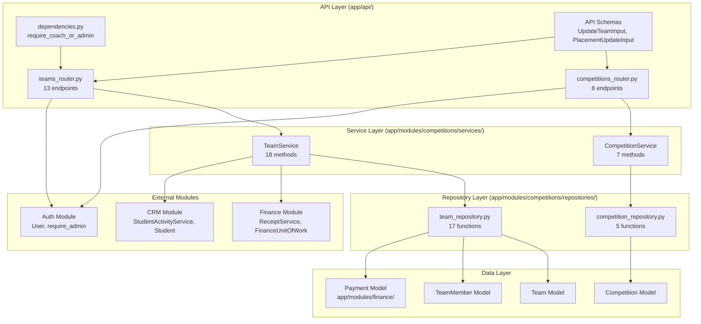
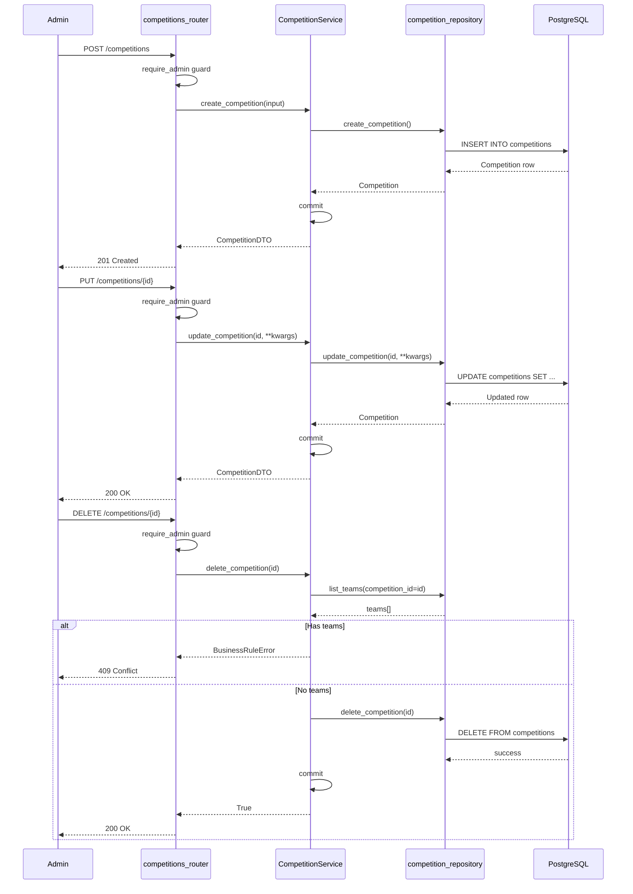
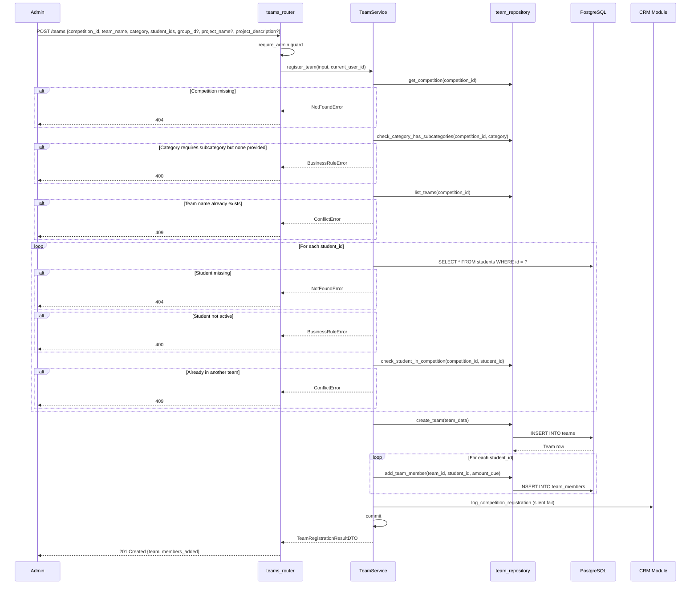
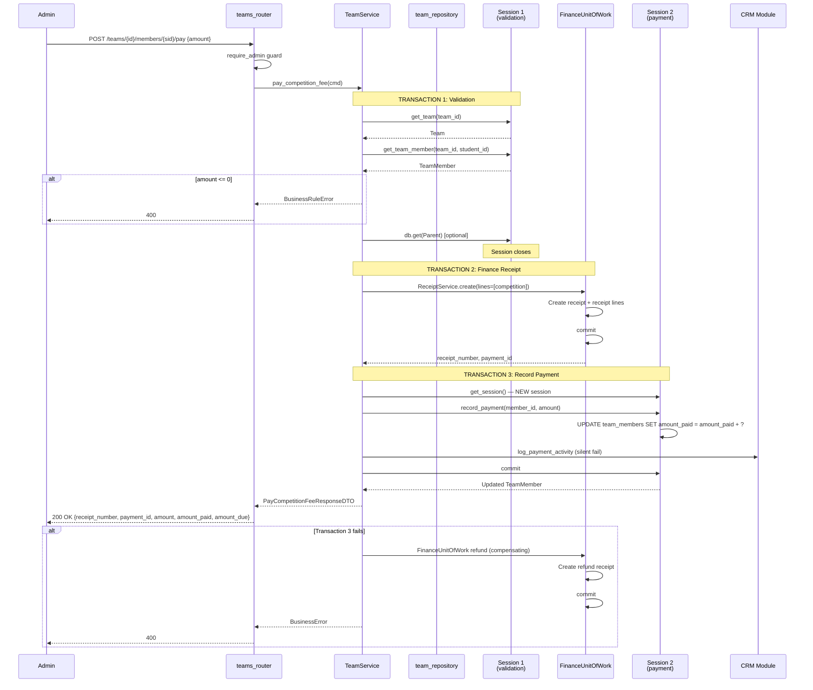
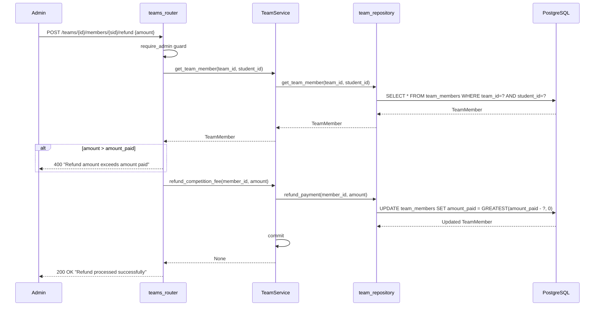
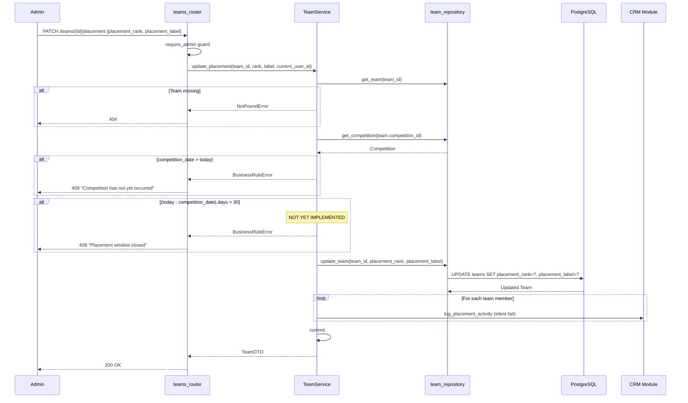
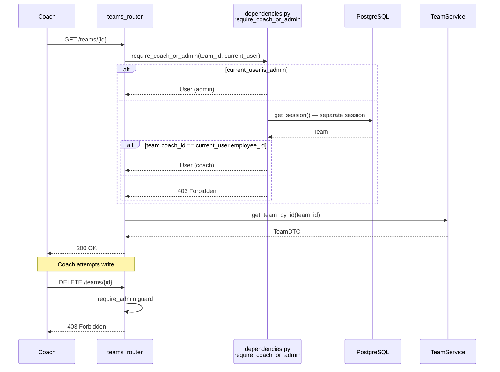
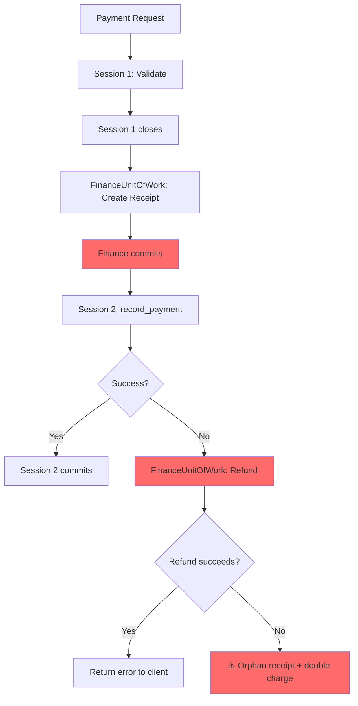

# Competition Module — Comprehensive Audit Report

**Date**: 2026-05-17
**Branch**: `010-competition-feature-enhancements`
**Scope**: Full audit of competition module workflows, architecture, security, performance, and spec compliance.

---

## Executive Summary

The competition module is **~85% complete**. All foundational work (migration, models, schemas, dead code removal, hard delete, coach read-only) is implemented and tested. Two high-priority gaps remain:

1. **Duplicate student registration** (FR-010) — currently hard-blocked instead of warn-and-allow
2. **30-day placement window** (FR-020) — upper bound not enforced

Two critical architectural issues require attention:
- `pay_competition_fee` uses **3 separate transactions** instead of atomic rollback
- `ReceiptService._link_competition_payment` references **non-existent fields** (`fee_paid`, `payment_id`)

---

## 1. Architecture Overview



---

## 2. Endpoint Inventory (21 endpoints)

| # | Method | Path | Auth | Request | Response | Status Codes |
|---|--------|------|------|---------|----------|-------------|
| 1 | GET | `/competitions` | any | — | `list[CompetitionDTO]` | 200, 401 |
| 2 | POST | `/competitions` | admin | `CreateCompetitionInput` | `CompetitionDTO` | 201, 401, 403, 422 |
| 3 | GET | `/competitions/{id}` | any | — | `CompetitionDTO` | 200, 401, 404 |
| 4 | PUT | `/competitions/{id}` | admin | `UpdateCompetitionInput` | `CompetitionDTO` | 200, 400, 401, 403, 404, 422 |
| 5 | PATCH | `/competitions/{id}` | admin | `UpdateCompetitionInput` | `CompetitionDTO` | 200, 400, 401, 403, 404, 422 |
| 6 | DELETE | `/competitions/{id}` | admin | — | `bool` | 200, 401, 403, 409 |
| 7 | GET | `/competitions/{id}/summary` | any | — | `CompetitionSummaryResponse` | 200, 401, 404 |
| 8 | GET | `/competitions/{id}/categories` | any | — | `list[CategoryResponse]` | 200, 401, 404 |
| 9 | GET | `/teams` | any (coach-filtered) | Query params | `list[TeamWithMembersDTO]` | 200, 400, 401 |
| 10 | POST | `/teams` | admin | `RegisterTeamInput` | `TeamRegistrationResultDTO` | 201, 400, 401, 403, 404, 409, 422 |
| 11 | GET | `/teams/{id}` | coach_or_admin | — | `TeamDTO` | 200, 401, 403, 404 |
| 12 | PUT | `/teams/{id}` | admin | `UpdateTeamInput` | `TeamDTO` | 200, 400, 401, 403, 404, 422 |
| 13 | PATCH | `/teams/{id}` | admin | `UpdateTeamInput` | `TeamDTO` | 200, 400, 401, 403, 404, 422 |
| 14 | DELETE | `/teams/{id}` | admin | — | `bool` | 200, 401, 403, 409 |
| 15 | GET | `/teams/{id}/members` | coach_or_admin | — | `TeamMemberListResponse` | 200, 401, 403, 404 |
| 16 | POST | `/teams/{id}/members` | admin | `AddTeamMemberInput` | `AddTeamMemberResultDTO` | 201, 400, 401, 403, 404, 409, 422 |
| 17 | DELETE | `/teams/{id}/members/{sid}` | admin | — | `bool` | 200, 400, 401, 403, 404 |
| 18 | POST | `/teams/{id}/members/{sid}/pay` | admin | `PayCompetitionFeeInput` | `PayCompetitionFeeResponseDTO` | 200, 400, 401, 403, 404 |
| 19 | POST | `/teams/{id}/members/{sid}/refund` | admin | `RefundCompetitionFeeBody` | `bool` | 200, 400, 401, 403, 404 |
| 20 | PATCH | `/teams/{id}/placement` | admin | `PlacementUpdateInput` | `TeamDTO` | 200, 400, 401, 403, 404, 409 |
| 21 | GET | `/students/{sid}/competitions` | any | — | `StudentCompetitionsResponse` | 200, 401, 404 |

---

## 3. Workflow Diagrams

### 3.1 Competition Lifecycle (US1)



### 3.2 Team Registration with Group Pre-Fill (US2)



### 3.3 Payment Flow — Multi-Transaction Architecture (US4)



### 3.4 Refund Flow (New — T051)



### 3.5 Placement Recording with 30-Day Window (US6)



### 3.6 Coach Read-Only Access



### 3.7 Competition Summary (N+1 Warning)

```mermaid
graph LR
    A[GET /competitions/{id}/summary] --> B[get_competition]
    B --> C[list_teams]
    C --> D{For each team}
    D --> E[list_team_members]
    E --> F{For each member}
    F --> G[db.get Student]
    G --> H[Build DTO]

    style G fill:#ff6b6b
    style F fill:#ff6b6b
    style E fill:#ff6b6b

    Note1["⚠️ N+1: 1 + N + N×M queries<br/>100 teams × 5 members = 601 queries"] -.-> G
```

---

## 4. Spec Compliance Matrix

| FR | Requirement | Status | Notes |
|----|-------------|--------|-------|
| FR-001 | Create competitions | ✅ Complete | POST /competitions |
| FR-002 | Edit/view competitions | ✅ Complete | PUT/PATCH/GET /competitions/{id} |
| FR-003 | Hard delete competitions | ✅ Complete | DELETE /competitions/{id}, blocked if teams exist |
| FR-004 | List competitions (any auth) | ✅ Complete | GET /competitions |
| FR-004a | Admin-only writes | ✅ Complete | All write endpoints use require_admin |
| FR-004b | Coach read-only | ✅ Complete | require_coach_or_admin on GET /teams/{id}, GET /teams/{id}/members |
| FR-005 | Create teams with project info | ✅ Complete | POST /teams accepts project_name, project_description |
| FR-006 | Group pre-fill | ⚠️ Partial | group_id stored but not used for pre-fill |
| FR-007 | Edit team details | ✅ Complete | PUT/PATCH /teams/{id} |
| FR-008 | Add/remove students | ✅ Complete | POST/DELETE /teams/{id}/members/{sid} |
| FR-009 | Hard delete teams | ✅ Complete | DELETE /teams/{id}, blocked if paid members |
| FR-010 | Warn on duplicate student | ❌ Missing | Currently hard-blocks with ConflictError |
| FR-011 | Verify active students | ✅ Complete | register_team checks s.status == "active" |
| FR-012 | Coach must be employee | ✅ Complete | FK constraint on team.coach_id → employees.id |
| FR-013 | amount_due/amount_paid | ✅ Complete | TeamMember model has both fields |
| FR-014 | Partial payments | ✅ Complete | pay_competition_fee supports any amount > 0 |
| FR-015 | Receipt creation | ✅ Complete | FinanceUnitOfWork creates receipt |
| FR-016 | Fee paid threshold | ✅ Complete | Derived: amount_paid >= amount_due |
| FR-017 | Filter teams | ✅ Complete | GET /teams?category=&subcategory= |
| FR-018 | Group by subcategory | ✅ Complete | GET /competitions/{id}/categories |
| FR-019 | Record placement | ✅ Complete | PATCH /teams/{id}/placement |
| FR-020 | 30-day placement window | ⚠️ Partial | Future date blocked; 30-day upper bound NOT implemented |
| FR-021 | Refund handling | ⚠️ Partial | amount_paid decremented; finance payment link not updated by competition module |
| FR-022 | Activity logging | ✅ Complete | Registration, payment, placement logged (silent fail) |
| FR-023 | Atomic payment | ⚠️ Partial | Compensating rollback, NOT truly atomic |

**Compliance**: 19/23 complete (83%), 4 partial/missing

---

## 5. Critical Issues

### 5.1 Payment Atomicity Gap (CRITICAL)



**Problem**: Three separate transactions create a window where the finance receipt exists but the team member's `amount_paid` is not updated. The compensating refund can also fail.

**Impact**: Orphan receipts, potential double-charging, inconsistent state between finance and competition modules.

**Fix**: Use a single session/transaction for the entire operation, or implement a saga pattern with idempotent compensation.

### 5.2 ReceiptService._link_competition_payment References Non-Existent Fields (CRITICAL)

```python
# receipt_service.py:366-367 — will crash at runtime:
team_member.fee_paid = True       # ❌ fee_paid does not exist
team_member.payment_id = payment_id  # ❌ payment_id does not exist
```

**Impact**: Any competition payment processed through the standard finance receipt flow (not the competition module's custom `pay_competition_fee`) will crash with `AttributeError`.

**Fix**: Remove or update `_link_competition_payment` to use `amount_paid` instead of `fee_paid`/`payment_id`.

### 5.3 Duplicate Student Registration Hard-Block (HIGH)

Spec says "warn but allow" (Option A). Implementation raises `ConflictError` in two places:
- `register_team()` line 107-114
- `add_team_member_to_existing()` line 413-418

**Fix**: Change to return `(result, warning_message)` and populate the response envelope's `message` field.

### 5.4 30-Day Placement Window Upper Bound Missing (HIGH)

```python
# team_service.py:367 — only checks future date:
if comp.competition_date and comp.competition_date > date.today():
    raise BusinessRuleError(...)

# Missing: upper bound check
# if (date.today() - comp.competition_date).days > 30:
#     raise BusinessRuleError("Placement window closed...")
```

---

## 6. Security Audit

| Severity | Issue | Detail |
|----------|-------|--------|
| MEDIUM | `require_coach_or_admin` TOCTOU | Opens separate DB session. Team could be deleted between auth check and service call. |
| MEDIUM | `**kwargs` in update methods | `update_competition`/`update_team` pass `**kwargs` to `setattr()`. API layer filters via Pydantic, but service methods accept arbitrary keys. |
| LOW | Student competition history exposed | `GET /students/{sid}/competitions` uses `require_any` — any authenticated user can view any student's data. |
| LOW | No rate limiting on payments | `POST /teams/{id}/members/{sid}/pay` has no rate limiting. Could be abused for receipt spam. |

---

## 7. Performance Audit

### N+1 Query Hotspots

| Endpoint | Query Count (100 teams) | Severity |
|----------|------------------------|----------|
| `GET /competitions/{id}/summary` | ~601 queries | SEVERE |
| `GET /teams` (with members) | ~101 queries | HIGH |
| `GET /students/{sid}/competitions` | ~21 queries (per 10 teams) | MEDIUM |
| `GET /teams/{id}/members` | ~22 queries (per 20 members) | MEDIUM |

### Missing Indexes

| Table | Column | Impact |
|-------|--------|--------|
| `teams` | `competition_id` | Full scan on list_teams, check_student_in_competition |
| `teams` | `category` | Full scan on category filter |
| `teams` | `coach_id` | Full scan on coach filtering |
| `team_members` | `team_id` | Full scan on list_team_members |
| `team_members` | `student_id` | Full scan on check_student_in_competition |
| `team_members` | `amount_paid` | Full scan on team delete guard |

---

## 8. Dead Code Inventory

| Location | Code | Status |
|----------|------|--------|
| `team_repository.py:120-127` | `get_teams_by_student()` | Unused — no service or endpoint calls it |
| `team_repository.py:35` | `create_team` accepts `fee` parameter | `fee` doesn't exist on `Team` model — dead parameter |
| `team_service.py:282-301` | `list_teams_for_coach()` returns raw models | Inconsistent with DTO pattern; only called internally |

---

## 9. Recommendations

### Immediate (Blockers)
1. **Fix `ReceiptService._link_competition_payment`** — remove references to `fee_paid`/`payment_id`
2. **Implement 30-day placement window** — add upper bound check in `update_placement`
3. **Implement duplicate student warning** — change ConflictError to warning in response envelope

### Short-term (High Impact)
4. **Fix payment atomicity** — consolidate to single transaction or implement saga pattern
5. **Add missing database indexes** — competition_id, category, coach_id, team_id, student_id on relevant tables
6. **Fix N+1 in `get_competition_summary`** — use JOIN or batch loading for students

### Medium-term
7. **Implement group pre-fill logic** — use `group_id` to populate `student_ids` from group roster
8. **Add rate limiting** on payment endpoints
9. **Remove dead code** — `get_teams_by_student`, unused `fee` parameter
10. **Add ownership check** on `GET /students/{sid}/competitions` — restrict to student's parents/guardians

---

## 10. Task Completion Status

| Phase | Tasks | Completed | Pending |
|-------|-------|-----------|---------|
| Phase 1: Migration | 6 | 1 (T001) | 5 (T002, T063-T066) |
| Phase 2: Foundational | 21 | 21 | 0 |
| Phase 3: US1 (Competition hard-delete) | 7 | 7 | 0 |
| Phase 4: US2 (Team hard-delete + project) | 14 | 14 | 0 |
| Phase 5: US3 (Project tracking) | 2 | 2 | 0 |
| Phase 6: US4 (Multi-payment fees) | 9 | 9 | 0 |
| Phase 7: US6 (Placement recording) | 3 | 3 | 0 |
| Phase 8: US5 (Subcategory filtering) | 2 | 2 | 0 |
| Phase 9: Coach read-only | 4 | 4 | 0 |
| Phase 10: Test updates | 11 | 0 | 11 |
| Phase N: Polish | 6 | 4 | 2 |
| **Total** | **85** | **67** | **18** |

**Completion**: 79% (67/85 tasks)
